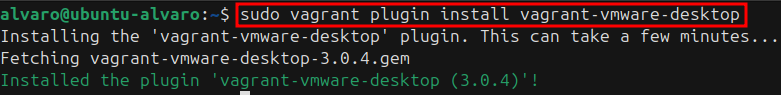
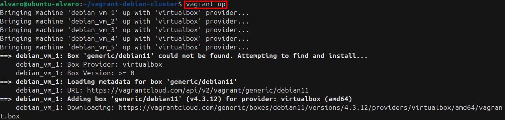

# Despliegue de Máquinas Debian con Vagrant y VirtualBox

## 1. Introducción

El objetivo de esta práctica es desplegar múltiples instancias de servidores Debian utilizando Vagrant en combinación con VirtualBox. Este enfoque permite la creación y administración eficiente de entornos virtualizados de manera automatizada.

Para esta prueba de concepto, se han desplegado tres máquinas virtuales Debian 12, optimizando los recursos disponibles. Se ha utilizado una máquina anfitriona con Ubuntu 24.04, sobre la cual se ha instalado y configurado Vagrant junto con VirtualBox como proveedor de virtualización.

## 2. Instalación y Configuración

### 2.1 Instalación de VirtualBox y Vagrant

Antes de proceder con la instalación de Vagrant, es necesario contar con VirtualBox instalado. Si no se tiene, puedes obtenerlo desde la página oficial de VirtualBox. Una vez descargado e instalado VirtualBox, procedemos a instalar Vagrant.

**Primer paso**, instalamos Vagrant:

```bash
sudo apt update && sudo apt install vagrant
```

**Segundo paso**, asegurarnos de que Vagrant esté configurado para usar VirtualBox como proveedor (por defecto, Vagrant usa VirtualBox si no se especifica otro proveedor):

```bash
vagrant plugin install vagrant-virtualbox
```



### 2.2 Configuración del Entorno

Una vez instaladas las herramientas, se procede a configurar el entorno de trabajo. Primero, creamos un directorio donde se almacenará la configuración de Vagrant:

```bash
mkdir ~/vagrant-debian-cluster && cd ~/vagrant-debian-cluster
```

Dentro de este directorio, inicializamos un nuevo entorno Vagrant:

```bash
vagrant init
```


Esto generará un archivo `Vagrantfile`, que contiene la configuración de la infraestructura virtual.

### 2.3 Configuración del Archivo Vagrantfile con ISO Local

En este caso vamos a utilizar una ISO descargada localmente en lugar de una box predefinida. Es necesario modificar el `Vagrantfile` para montar la ISO en la máquina virtual y permitir la instalación manual o automatizada. Suponiendo que la ISO se encuentra en `/home/alvaro/Descargas/debian-12.9.0-amd64-netinst.iso`, el archivo de configuración se ajusta de la siguiente manera:

```ruby
Vagrant.configure("2") do |config|
  num_machines = 5  # Se crean exactamente 5 máquinas

  (1..num_machines).each do |i|
    config.vm.define "debian_vm_#{i}" do |node|
      node.vm.box = "generic/debian11"  # Usa una box oficial de Debian 11

      node.vm.provider "virtualbox" do |vb|
        vb.memory = 256  # 256MB de RAM
        vb.cpus = 1      # 1 CPU
        vb.customize ["modifyvm", :id, "--vram", "16"]
        # Comentamos o eliminamos la línea de redimensionado del disco
        # vb.customize ["modifyhd", :id, "--resize", 2048]  # 2GB de HDD
      end

      node.vm.network "private_network", type: "dhcp"  # Red privada con DHCP

      # Provisionamiento: instalar y activar SSH
      node.vm.provision "shell", inline: <<-SHELL
        sudo apt update -y
        sudo apt install -y openssh-server
        sudo systemctl enable ssh
        sudo systemctl start ssh
      SHELL
    end
  end
end
```

Este archivo configura:

- El número de máquinas virtuales a crear (5).
- La asignación de nombres y recursos de hardware para cada instancia, como la memoria RAM (256 MB) y el número de CPUs (1).
- La configuración del arranque desde la unidad de DVD (`--boot1 dvd`).
- La máquina virtual utilizará una ISO personalizada proporcionada a través de la configuración de Vagrant, en lugar de una ruta de ISO fija.

### 2.4 Despliegue de Máquinas Virtuales

Para iniciar la creación y configuración de las máquinas virtuales, ejecutamos:

```bash
vagrant up --provider=virtualbox
```




Este comando creará las máquinas virtuales en VirtualBox y las iniciará desde la ISO.

### 2.5 Instalación del Sistema Operativo

Dado que las máquinas arrancarán desde la ISO, será necesario completar la instalación manualmente o, en su defecto, utilizar un archivo de configuración predefinido (`preseed.cfg`) para automatizar el proceso.

### 2.6 Acceso a las Máquinas Virtuales

Una vez finalizada la instalación y configurado el acceso SSH, es posible conectarse a cada máquina utilizando:

```bash
vagrant ssh debian-1
vagrant ssh debian-2
vagrant ssh debian-3
```

### 2.7 Administración de las Máquinas Virtuales

Para detener temporalmente las máquinas sin eliminarlas:

```bash
vagrant halt
```

Para destruir completamente las máquinas virtuales y liberar los recursos asignados:

```bash
vagrant destroy
```

Este comando solicitará confirmación antes de eliminar las instancias.

## 3. Conclusión

Mediante el uso de Vagrant y VirtualBox, se ha logrado desplegar y administrar múltiples servidores Debian de manera automatizada y eficiente utilizando una ISO local. Este enfoque simplifica la creación y gestión de entornos de prueba o desarrollo, permitiendo un control centralizado de los recursos virtuales.

Además, se ha demostrado la facilidad de acceso a las máquinas mediante SSH, así como las opciones para detener o eliminar las instancias según sea necesario. Este método es altamente escalable y adaptable a diferentes escenarios de virtualización y automatización de infraestructura.